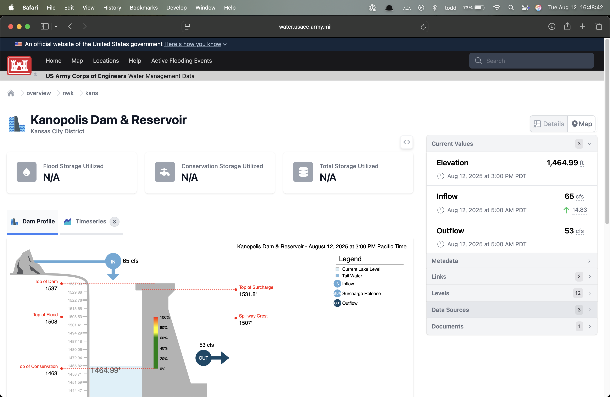
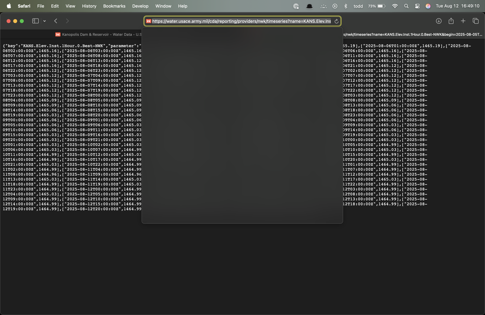
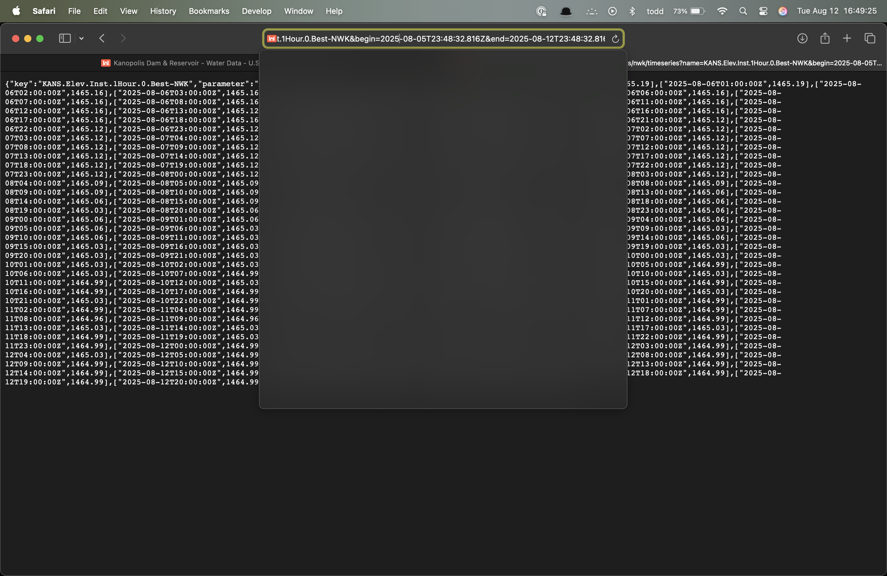
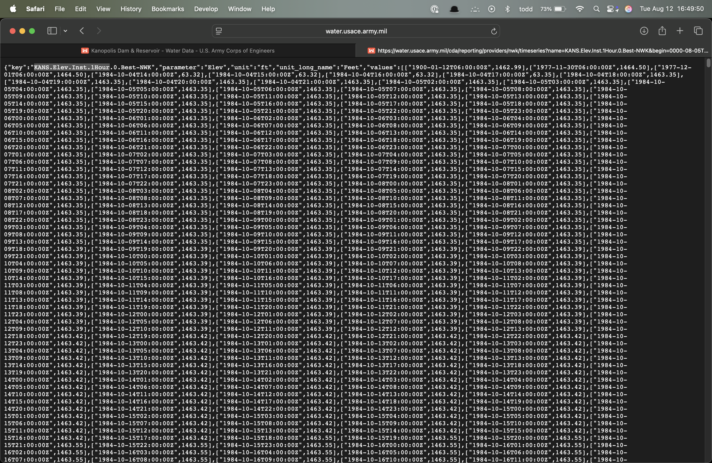
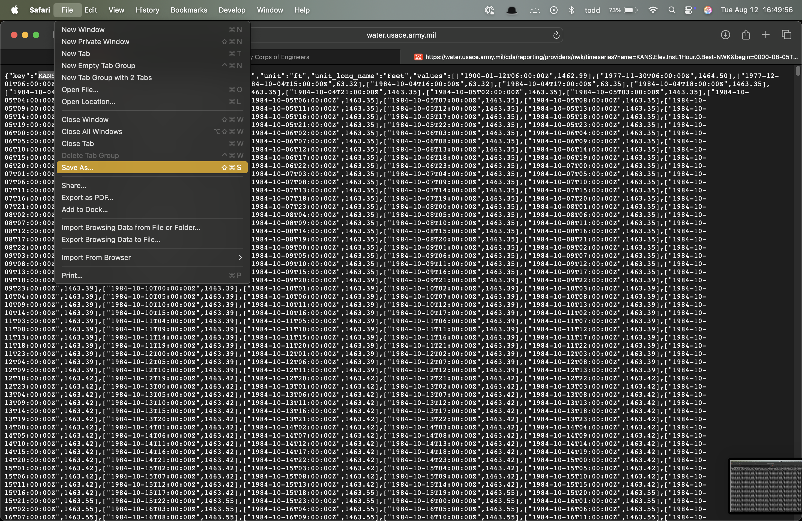
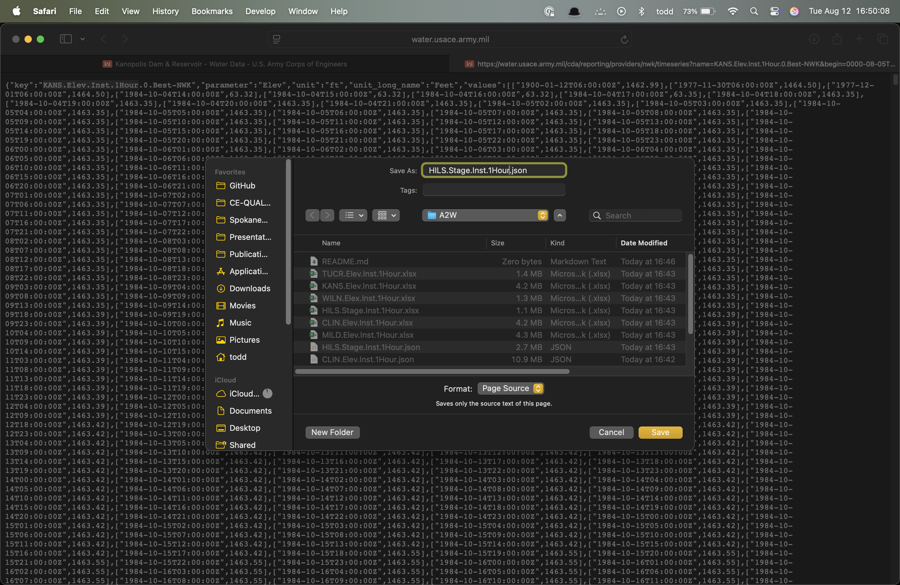

# Downloading and Processing Hydrology Data using Access2Water (A2W) via the CWMS API

## Downloading the Data

Browse to the Access2Water (A2W) website at [https://water.usace.army.mil](https://water.usace.army.mil).

{width=400px}

In the search field, type in the name (or part of the name) of the USACE project (reservoir, dam, etc.) you are looking for.

{width=400px}

A list should pop up displaying one or more locations that match your search criteria. Select the site you are looking for.

{width=400px}

A web page will load for your selected site. Near the bottom-left of the page, select "Data Sources".

{width=400px}

In the JSON column, click on the icon corresponding to the data you want to access.

{width=400px}

A JSON file will load showing the data for the past month.

{width=400px}

Click in the search bar and cursor to the right. You will see a time window specification that looks like this: "begin=2025-08-06T00:00:19.479Z&end=2025-08-13T00:00:19.479Z".

{width=400px}

Change the start date to the earliest date you are looking for. If you want the entire period of record, replace "2025" with "0000". Press enter. You should see more data appear on the screen.

{width=400px}

This web page is a JSON file. Save the file to your local storage. We recommend that you highlight and copy the part of the string that contains the site name, parameter, and interval information, e.g., "KANS.Flow-In.Ave.1Day.1Day". Select File, then select Save As.

{width=400px}

When the dialog opens, paste the name you copied above. Make sure the extension is ".json". Press Enter to save the data.

{width=400px}

## Processing the Data

In your terminal (command prompt), change to this folder and run the python script, "parse_json_to_excel.py". This script will automatically find and process (parse) every JSON file in the folder, saving the date-time and value to an Excel file of the same name.